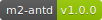

# m2-antd

[](https://github.com/hmiinyu/m2-antd.git) <br/>
The package is provided facilities and utilities based on antd and ant-mobile.

### Usage
 - Install
```bash
npm install m2-antd
yarn add m2-antd
```
### Mobile APIs
 - `CardList` **class** Render the container based on antd-mobile ListView and PullToRefresh.
 ####
 | props | type | description | required | example |
 | ------------ | ------------ | ------------ | ------------ | ------------ |
 | loadData | func | async load data when user pull the scrollbar | yes | the function is from an async action from redux |
 | params | object | the params for loadData function | yes | the params include page and pageSize generally |
 | renderRow | func | render each data item after data has been loaded | yes | the function is rendered each child component |
 | eventType | string | data re-render event-type listener | yes | the event-type is from async type from redux |
 | scrollSettings | object | scroll settings include *onScroll*,*scrollerOptions*,*scrollRenderAheadDistance*,*scrollEventThrottle* | no | |
 | threshold | number | the threshold will be reached the bottom when calling onEndReached | no | 20 |
 | loadingText | string | | no | '努力加载中...' |
 | completedText | string | | no | '加载完毕' |
 ```js
 import React from 'react'
 import { connect} from 'm2-redux'
 import { CardList } from 'm2-antd/mobile'
 import { getProductListType } from '@/features/app/redux/types'
 import { getProductList } from '@/features/product/redux/actions'
 import ProductItem from '@/features/product/components/product-item'

 @connect({ actions: { getProductList }})
 export default class ProductList extends React.Component {
   state = {
     params: {
       page: 1,
       pageSize: 5
     }
   }
   
   render() {
     const { getProductList } = this.props
     const { params } = this.state
     
     return (
       <CardList renderRow={row => (row && (<ProductItem item={row}/>))} 
                 loadData={getProductList}
                 params={params}
                 eventType={getProductListType}/>
     )
   }
 }
 
 export default ProductList
```
 - `Loading` **class** Render the loading component when async fetch data from server.
 ####
 | props | type | description | required | example |
 | ------------ | ------------ | ------------ | ------------ | ------------ |
 | id | string | the container id for loading component | no | 'indicator' |
 | text | string | the loading text | no | '正在加载中...' |
```js
import React from 'react'
import { render } from 'm2-react'
import { Root } from 'm2-redux'
import { Loading } from 'm2-antd/mobile'
import AppRouter from '@/features/app/router'
import AppStore from '@/features/app/redux/store'

render({
  components: [
    <Loading key="loading"/>,
    <Root {...AppStore} {...AppRouter} key="root"/>
  ]
})
```
 - `PickerItem` **class** Render the Picker component for retrieving the single value based on antd-mobile.
 ####
 | props | type | description | required | example |
 | ------------ | ------------ | ------------ | ------------ | ------------ |
 | data | array | the picker datasource | yes |  |
 | field | string | the field name of current item  | yes | 'district' |
 | label | string | the text in the leftside | yes | 'Select District' |
 | getFieldProps | func | the rc-form getFieldProps method | yes |  |
 | setFieldValue | func | the rc-form setFieldValue method | yes | |
 | config | object | the extra options | no |  |
```js
 import React from 'react'
 import { createForm } from 'rc-form'
 import { Button } from 'antd-mobile'
 import { PickerItem } from 'm2-antd/mobile' /* 待发布(可用其他组件代替) */
 import { initialFormComponent } from 'm2-react'
 import { district } from 'antd-mobile-demo-data'

 class AppForm extends React.Component {
  componentWillMount() {
    initialFormComponent(this)
  }
  
  submit() {
    console.log(this.form.values)  
  }
  
  render() {
   return (
     <div className="App">
      <PickerItem label="Select District" data={district} field="district" {...this.form}/>
      <Button onClick={()=>this.submit()}>Submit</Button>
     </div>
    ) 
  }
 }
 
 export default createForm()(AppForm)
```
 - `NavBar` **class** Render the NavBar component for header based on antd-mobile.
 ####
 | props | type | description | required | example |
 | ------------ | ------------ | ------------ | ------------ | ------------ |
 | title | string | the navbar title | yes |  |
 | left | object | the navbar left content | no | <Icon type="left" /> |
 | backUrl | string | the redirect url when click left content | no |  |
 | right | string | the navbar right content | no |  |
 | mode | string | the navbar mode | no | 'dark' |
```js
 import React from 'react'
 import { NavBar } from 'm2-antd/moible'
 
 export default () => {
  return (
    <>
      <NavBar title="首页" left=""/>
      <NavBar title="详情页"/>
      <NavBar title="详情页" backUrl="/products"/>
    </>
  )
 }
```
 - `TabBar` **class** Render the TabBar component for footer based on antd-mobile..
 ####
 | props | type | description | required | example |
 | ------------ | ------------ | ------------ | ------------ | ------------ |
 | items | array | the tabbar data source | yes | |
 | keyField | string | the key field of data source | no | 'key' |
 | colors | object | the tabbar color configuration | no |  |
```js
 import React from 'react'
 import { Mysql } from 'm2-core'
 import { TabBar } from 'm2-antd/moible'
 
 export default () => {
  const menus_1 = [
    { title: '首页', url: '/', icon: 'home.png', selectedIcon: 'home_selected.png' },
    { title: '任务', url: '/task', icon: 'task.png', selectedIcon: 'task_selected.png' },
    { title: '项目', url: '/project', icon: 'project.png', selectedIcon: 'project_selected.png' },
    { title: '我的', url: '/profile', icon: 'profile.png', selectedIcon: 'profile_selected.png' }
  ]
  
  const menus_2 = [
    { title: '首页', url: '/', icon: 'home.png', selectedIcon: 'home_selected.png' },
    { title: '任务', url: '/task', icon: 'task.png', selectedIcon: 'task_selected.png' },
    { title: '项目', url: '/project', icon: 'project.png', selectedIcon: 'project_selected.png' },
    { title: '我的', url: '/profile', icon: 'profile.png', selectedIcon: 'profile_selected.png' }
  ].map(item => ({ ...item, key: Mysql.randomString(5)}))
  
  return (
    <>
      <TabBar items={menus_1}/>
      <TabBar items={menus_2} keyField="key"/>
    </>
  )
 }
```
 - `SectionTitle` **class** Render the section title based on antd-mobile.
 ####
 | props | type | description | required | example |
 | ------------ | ------------ | ------------ | ------------ | ------------ |
 | title | string | the section title | yes |  |
 | arrow | bool/string | the right arrow | no | 'horizontal' |
 | click | func | the event handler when click the right content | no |  |
```js
 import React from 'react'
 import { SectionTitle } from 'm2-antd/moible'
 
 export default () => {
  return (
    <>
      <SectionTitle title="最新上架"/>
      <SectionTitle title="更多推荐" arrow={true} click={() => location.hash='/more'}/>
    </>
  )
 }
